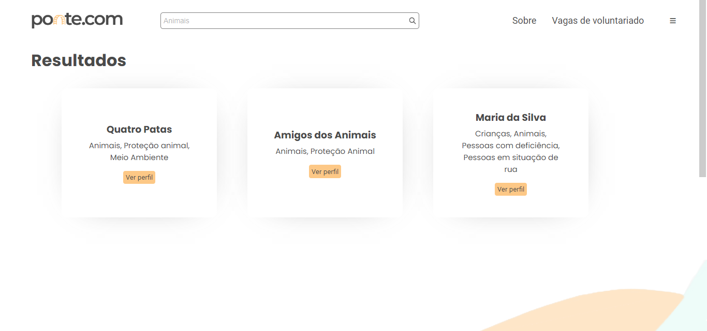
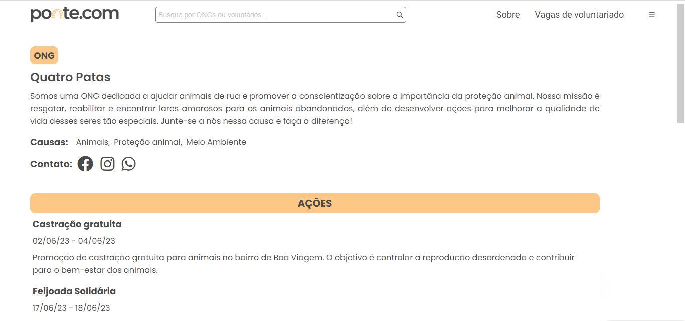
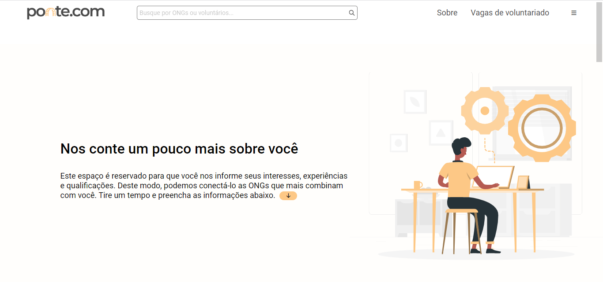
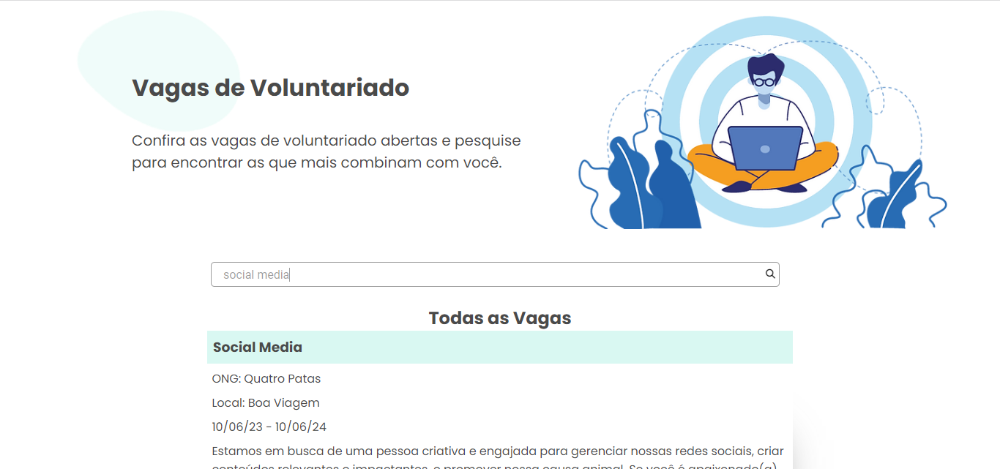

# Programação de Funcionalidades

Pré-requisitos: <a href="02-Especificação do Projeto.md"> Especificação do Projeto</a>, <a href="03-Metodologia.md"> Metodologia</a>, <a href="04-Projeto de Interface.md"> Projeto de Interface</a>

As telas desenvolvidas apresentadas no <a href="04-Projeto de Interface.md"> Projeto de Interface</a> buscam atender aos requisitos funcionais e não funcionais do site. A seguir, especificamos quais requisitos são atendidos em quais telas da aplicação. 

>- **RF-001: Pesquisar novas ONGs e RF-005: Filtro para perfil de voluntários**

 

 
 
Após o login de usuário, todas as telas da aplicação atendem ao requisito funcional para pesquisa de novas ONGs, assim como para pesquisa e filtro de voluntários, visto que é implementada uma barra de pesquisa que serve para este fim. Uma vez logado, o usuário consegue pesquisar tanto por nome quanto pelas causas defendidas pelas ONGs e interesses dos voluntários como, por exemplo, meio ambiente, animais, entre outros. Estes requisitos são de prioridade alta.

>- **RF-002: Apresentar perfil de ONGs e RF-004: Permitir o contato direto entre ONGs e voluntários**

 

 

A tela de perfil da ONG (TELA 05) atende ao RF-002, de prioridade alta, ao possibilitar a criação do perfil das ONGs, contendo suas informações mais relevantes, como causas defendidas, ações realizadas e vagas abertas para voluntários. Além disso, contém meios de contato com botões que redirecionam para outras redes sociais e conversa via WhatsApp com a ONG, atendendo também ao RF-004, de prioridade baixa, ao permitir o contato direto entre ONGs e voluntários.

>- **RF-003: Possibilitar a criação de perfil de voluntários**

 

A tela de formulário detalhado para voluntários (TELA 04) atende ao RF-003 ao possibilitar a criação de perfil com informações dos voluntários. Este requisito é de prioridade alta.

>- **RF-006: Filtro para perfil de ONGs e trabalhos voluntários**

 

A tela de lista de vagas (TELA 08) atende ao RF-006, através de campo de pesquisa de vagas de voluntariado. Os usuários conseguem filtrar as vagas desejadas através de pesquisa por termos que englobam nome, descrição, ONG responsável e período das vagas disponibilizadas. Este requisito tem prioridade alta.

<!--
>- **RF-007: Permitir o compartilhamento de vagas de voluntariado em redes sociais**

 

A tela de lista de vagas (TELA 08) atende ao RF-007 para compartilhamento de vagas. O usuário tem a possibilidade de compartilhar uma vaga em suas redes sociais através de botões de compartilhamento presentes na página. Este requisito é de prioridade média.

 >// DESCRIÇÃO DA SEÇÃO:
Implementação do sistema descritas por meio dos requisitos funcionais e/ou não funcionais. Deve relacionar os requisitos atendidos os artefatos criados (código fonte) além das estruturas de dados utilizadas e as instruções para acesso e verificação da implementação que deve estar funcional no ambiente de hospedagem.

Para cada requisito funcional, pode ser entregue um artefato desse tipo

> **Links Úteis**:
>
> - [Trabalhando com HTML5 Local Storage e JSON](https://www.devmedia.com.br/trabalhando-com-html5-local-storage-e-json/29045)
> - [JSON Tutorial](https://www.w3resource.com/JSON)
> - [JSON Data Set Sample](https://opensource.adobe.com/Spry/samples/data_region/JSONDataSetSample.html)
> - [JSON - Introduction (W3Schools)](https://www.w3schools.com/js/js_json_intro.asp)
> - [JSON Tutorial (TutorialsPoint)](https://www.tutorialspoint.com/json/index.htm)
